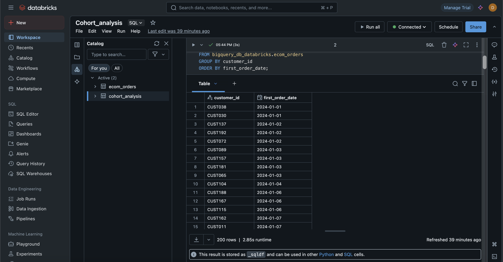
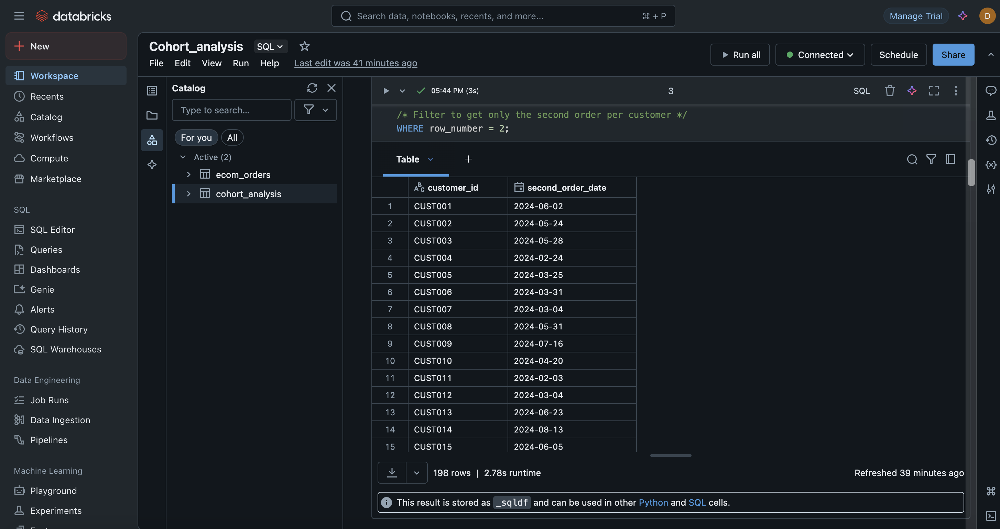
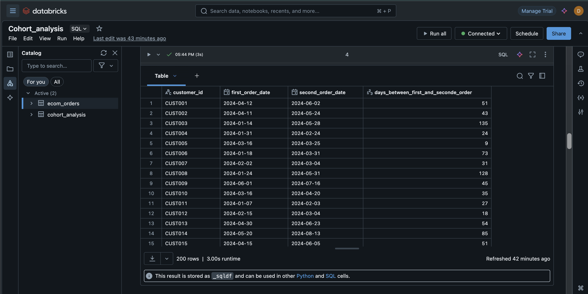
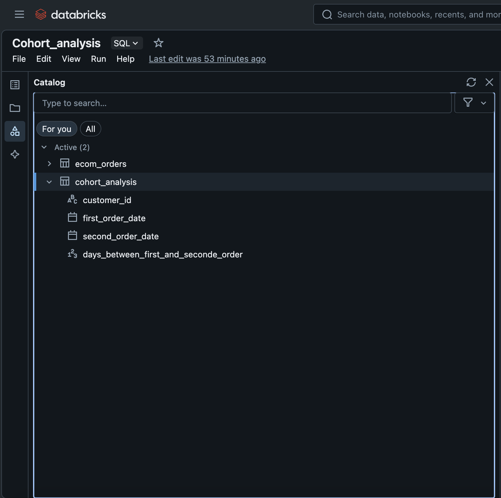
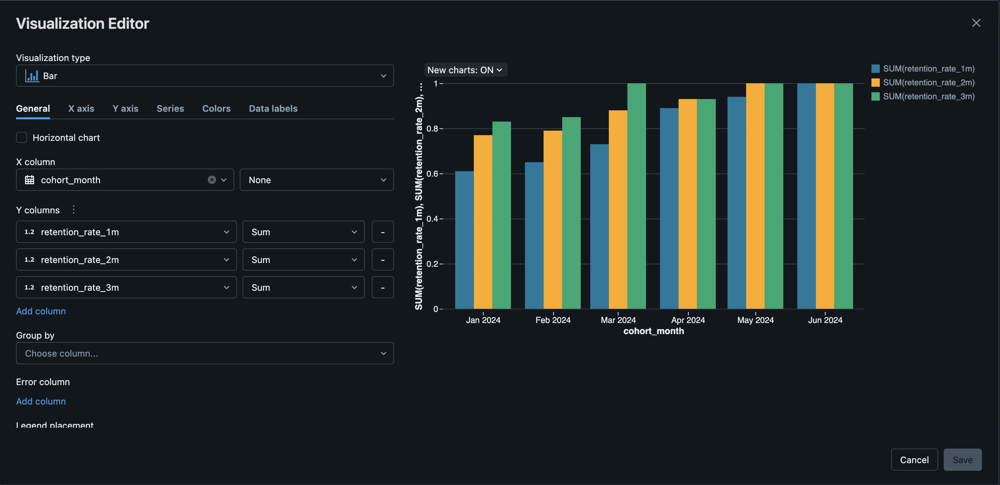
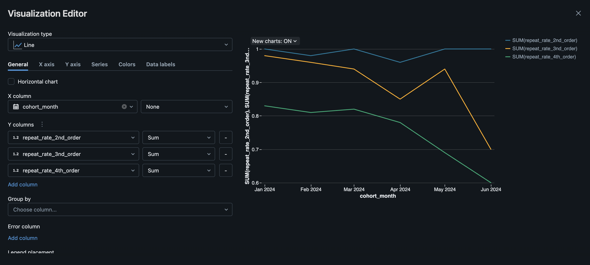
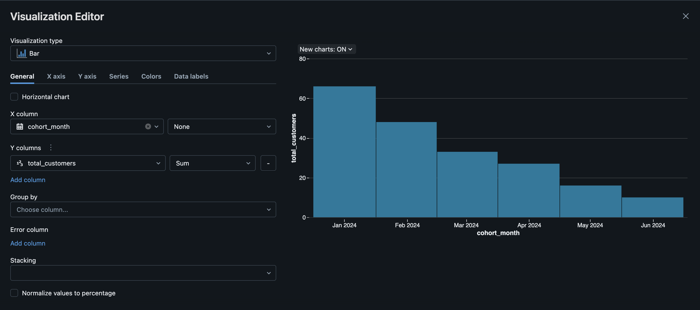

# Cohort Analysis Workflow

This file documents all the SQL queries used in this project, alongside the visualizations that help interpret the results.

---

## 📌 1. First Order per Customer

This query calculates, for each customer, the minimum (first) order date.

```sql
/* 
  Calculate the first order date for each customer.
  This is done by grouping by customer_id and selecting the earliest order_date (MIN).
*/

SELECT customer_id,
       MIN(order_date) as first_order_date  -- earliest purchase date for the customer
FROM bigquery_db_databricks.ecom_orders
GROUP BY customer_id
ORDER BY first_order_date;
```
📋 Below, you can see the result table generated by this query inside Databricks.


## 📌 2. Second Order per Customer

This query calculates the second purchase date for each customer by identifying the earliest order date that comes after their first order.

```sql
/* 
   Compute, for each customer, the earliest order date 
   that is later than their first purchase date.
*/

SELECT 
      customer_id,
      order_date AS second_order_date

FROM (
    /* Assign a row number to each order per customer, ordered by date */
    SELECT customer_id,
           order_date,
           ROW_NUMBER() OVER (PARTITION BY customer_id ORDER BY order_date) AS row_number
    FROM bigquery_db_databricks.ecom_orders
)

/* Filter to get only the second order per customer */
WHERE row_number = 2;
```
📋 Below, you can see the result table generated by this query inside Databricks.



## 📌 3. First vs Second Order Gap

This query shows the first purchase date, the second purchase date (if available), and calculates the number of days between both for each customer.

```sql
/* 
   Include the customer’s first purchase date, second purchase date, 
   and the number of days between these dates.
*/

-- Step 1: Get the first order date per customer
WITH first_order_date AS (
  SELECT 
    customer_id,
    MIN(order_date) AS first_order_date
  FROM bigquery_db_databricks.ecom_orders
  GROUP BY customer_id
  ORDER BY first_order_date
),

-- Step 2: Get the second order date per customer using row_number
second_order_date AS (
  SELECT 
    customer_id,
    order_date AS second_order_date
  FROM (
    SELECT 
      customer_id,
      order_date,
      ROW_NUMBER() OVER (PARTITION BY customer_id ORDER BY order_date) AS row_number
    FROM bigquery_db_databricks.ecom_orders
  )
  WHERE row_number = 2
)

-- Step 3: Join both datasets and calculate days between first and second order
SELECT
  f.customer_id,
  f.first_order_date,
  s.second_order_date,
  DATE_DIFF(s.second_order_date, f.first_order_date) AS days_between_first_and_seconde_order
FROM first_order_date AS f 
LEFT JOIN second_order_date AS s
  ON f.customer_id = s.customer_id;
```
📋 Below, you can see the result table generated by this query inside Databricks.


## 📌 4. Create cohort_analysis Table

This query creates a new table called cohort_analysis in the Databricks database.
It contains the first and second purchase dates per customer and the number of days between both.

```sql
/* 
   Create a new table `cohort_analysis` in the Databricks database 
   using the result of the previous query that includes:
   - first purchase date
   - second purchase date
   - days between the two
*/

-- Create a new table from the query result
CREATE TABLE cohort_analysis AS  

-- Step 1: Get the first order date per customer
WITH first_order_date AS (
  SELECT 
    customer_id,
    MIN(order_date) AS first_order_date
  FROM bigquery_db_databricks.ecom_orders
  GROUP BY customer_id
  ORDER BY first_order_date
),

-- Step 2: Get the second order date using row_number
second_order_date AS (
  SELECT 
    customer_id,
    order_date AS second_order_date
  FROM (
    SELECT 
      customer_id,
      order_date,
      ROW_NUMBER() OVER (PARTITION BY customer_id ORDER BY order_date) AS row_number
    FROM bigquery_db_databricks.ecom_orders
  )
  WHERE row_number = 2
)

-- Step 3: Join both sets and calculate the number of days between the first and second order
SELECT
  f.customer_id,
  f.first_order_date,
  s.second_order_date,
  DATE_DIFF(s.second_order_date, f.first_order_date) AS days_between_first_and_seconde_order
FROM first_order_date AS f 
LEFT JOIN second_order_date AS s
  ON f.customer_id = s.customer_id;
```
📋 Below, you can see the result table Created by this query inside Databricks.


## 📌 5. Retention Rate by Cohort

This query calculates monthly customer retention rates by identifying users who placed a second order within 1, 2, and 3 months after their first purchase.
Customers are grouped into monthly cohorts based on their first order date.

```sql
/* 
   For each customer, calculate the first and second purchase dates 
   from the ecom_orders table. 
   Then group customers into monthly cohorts based on the first purchase date,
   and calculate retention rates within 1, 2, and 3 months after their first order.
*/

-- Step 1: Get each customer's first order date
WITH first_order_date AS (
  SELECT 
    customer_id,
    MIN(order_date) AS first_order_date
  FROM bigquery_db_databricks.ecom_orders
  GROUP BY customer_id
  ORDER BY first_order_date
),

-- Step 2: Get each customer's second order date using row_number()
second_order_date AS (
  SELECT 
    customer_id,
    order_date AS second_order_date
  FROM (
    SELECT 
      customer_id,
      order_date,
      ROW_NUMBER() OVER (PARTITION BY customer_id ORDER BY order_date) AS row_number
    FROM bigquery_db_databricks.ecom_orders
  )
  WHERE row_number = 2
),

-- Step 3: Combine first and second order info, compute cohort month and time between orders
monthly_cohorts AS (
  SELECT
    f.customer_id AS customer_id,
    DATE_TRUNC('MONTH', f.first_order_date)::DATE AS cohort_month,
    DATE_TRUNC('MONTH', s.second_order_date)::DATE AS second_order_month,
    DATE_DIFF(MONTH, f.first_order_date, s.second_order_date) AS months_between_first_and_seconde_order
  FROM first_order_date AS f 
  LEFT JOIN second_order_date AS s
    ON f.customer_id = s.customer_id
)

-- Step 4: Calculate retention rates for customers who placed a second order within 1, 2, or 3 months
SELECT 
  cohort_month,
  COUNT(*) AS total_customers,
  ROUND(COUNT(customer_id) FILTER (
    WHERE months_between_first_and_seconde_order <= 1
  ) / COUNT(DISTINCT customer_id), 2) AS retention_rate_1m,
  ROUND(COUNT(customer_id) FILTER (
    WHERE months_between_first_and_seconde_order <= 2
  ) / COUNT(DISTINCT customer_id), 2) AS retention_rate_2m,
  ROUND(COUNT(customer_id) FILTER (
    WHERE months_between_first_and_seconde_order <= 3
  ) / COUNT(DISTINCT customer_id), 2) AS retention_rate_3m
FROM monthly_cohorts
GROUP BY cohort_month
ORDER BY cohort_month;
```

📊 Below, you can see the visualization created directly in Databricks, showing retention rates across customer cohorts over time.

From the visualization we can tell that:

- **May and June 2024 cohorts** show the **highest retention rates** across all time thresholds (1-month, 2-months, and 3-months), each consistently hitting the 1.0 mark, meaning **100% of customers returned** within 3 months.
- For the **1-month retention**, **May 2024** had a slightly higher retention than previous cohorts, showing a steady increase compared to January–March.
- The difference between **1-month** and **3-month retention** is relatively small for the later cohorts (April to June), indicating **strong short-term and long-term engagement**.
- In contrast, **earlier cohorts (January–February 2024)** had noticeably lower retention, especially at the 1-month mark, suggesting weaker immediate re-engagement during that period.

These trends may reflect improved marketing strategies, better product offerings, or seasonal influences introduced in Q2 2024.



## 📌 6. Repeat Purchase Rate by Cohort

This query calculates, for each monthly cohort, the percentage of customers who made at least a 2nd, 3rd, or 4th purchase.
It helps assess long-term customer engagement and purchase behavior over time.

```sql
/* 
   For each customer, calculate the cohort month (based on first purchase) 
   and total number of orders.
   Then group customers into monthly cohorts and compute repeat purchase rates
   — the percentage of customers who placed at least a 2nd, 3rd, and 4th order.
*/

-- Step 1: Compute each customer's cohort month and their total number of orders
WITH first_order_date AS (
  SELECT 
    customer_id,
    DATE_TRUNC('MONTH', MIN(order_date))::DATE AS cohort_month,
    COUNT(order_id) AS total_orders
  FROM bigquery_db_databricks.ecom_orders
  GROUP BY customer_id
)

-- Step 2: For each cohort, calculate the percentage of customers with at least:
-- a 2nd, 3rd, and 4th order (repeat purchase behavior)
SELECT 
  cohort_month,
  ROUND(COUNT(customer_id) FILTER (
    WHERE total_orders >= 2
  ) / COUNT(DISTINCT customer_id), 2) AS repeat_rate_2nd_order,

  ROUND(COUNT(customer_id) FILTER (
    WHERE total_orders >= 3
  ) / COUNT(DISTINCT customer_id), 2) AS repeat_rate_3nd_order,

  ROUND(COUNT(customer_id) FILTER (
    WHERE total_orders >= 4
  ) / COUNT(DISTINCT customer_id), 2) AS repeat_rate_4th_order

FROM first_order_date
GROUP BY cohort_month
ORDER BY cohort_month;
```

📊 Below, you can see the visualization created directly in Databricks, showing repeat purchase behavior across cohorts.

From the visualization we can tell that:

- 🟦 The **2nd order repeat rate** remains consistently high across all cohorts, generally above **0.95**, showing strong likelihood that customers who make a first purchase are very likely to return at least once.
- 🟧 The **3rd order repeat rate** begins slightly lower and trends downward over time. This suggests a gradual drop-off in continued engagement past the second purchase.
- 🟩 The **4th order repeat rate** shows a more noticeable **decline**, especially for the more recent cohorts (May–June 2024), indicating fewer customers are reaching high levels of repeat purchasing.
- 📉 Overall, the trend shows **early customer retention is strong**, but **long-term loyalty (3rd and 4th orders)** requires improvement.

These insights can help guide re-engagement strategies focused on converting 2nd-time buyers into long-term repeat customers.



## 📌 7. Cohort Size by Month

This query calculates the number of new customers acquired each month, based on the date of their first purchase.
It gives insight into customer acquisition trends over time.

```sql
/* 
   Count the number of new customers acquired in each month.
   A new customer is identified by their first order date.
*/

-- Step 1: Identify the cohort month for each customer (month of their first order)
WITH first_order_date AS (
  SELECT 
    customer_id,
    DATE_TRUNC('MONTH', MIN(order_date))::DATE AS cohort_month
  FROM bigquery_db_databricks.ecom_orders
  GROUP BY customer_id
)

-- Step 2: Count how many customers had their first order in each cohort month
SELECT 
  cohort_month,
  COUNT(DISTINCT customer_id) AS total_customers
FROM first_order_date
GROUP BY cohort_month
ORDER BY cohort_month;
```
📊 Below, you can see the visualization created directly in Databricks, showing the number of new customers acquired each month.

From the visualization we can tell that:

- 📈 **January 2024** shows the highest number of new customers, making it the largest cohort by volume.
- 📉 The cohort size **decreases progressively** in each subsequent month.
- This decline could indicate reduced acquisition efforts, seasonal trends, or lower marketing reach over time.

Tracking cohort sizes is essential to understand the impact of acquisition strategies and their consistency month over month.




---

🙏 **Thank You!**

Thank you for taking the time to explore this cohort analysis workflow.  
I hope you found the process insightful and the analysis meaningful.  
Feel free to reach out or connect if you have any thoughts, questions, or feedback!
