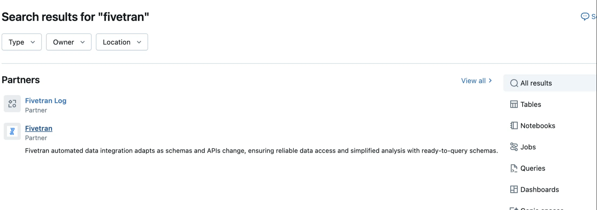
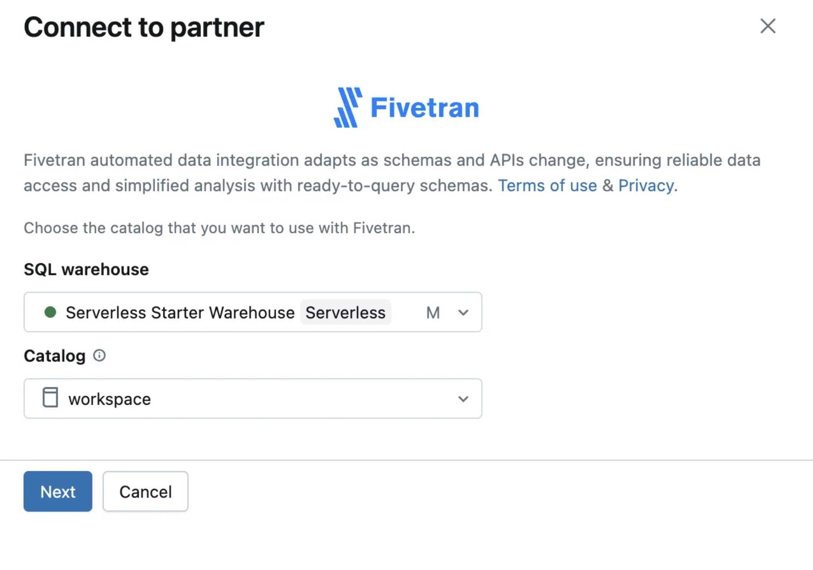
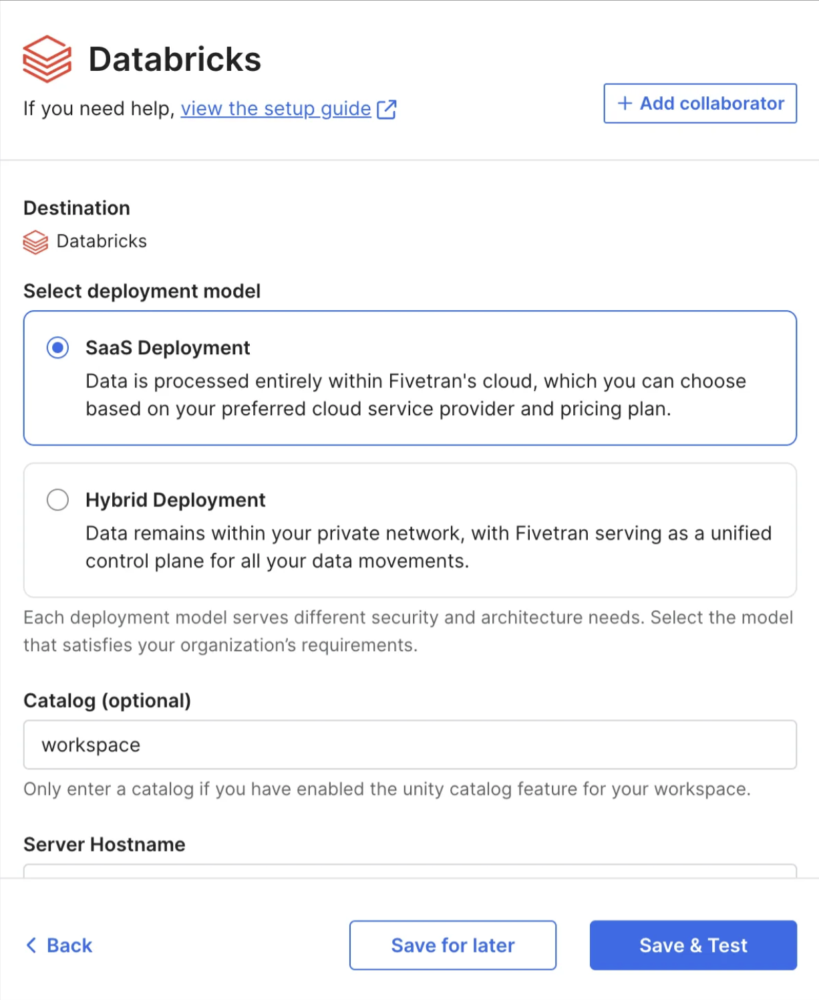
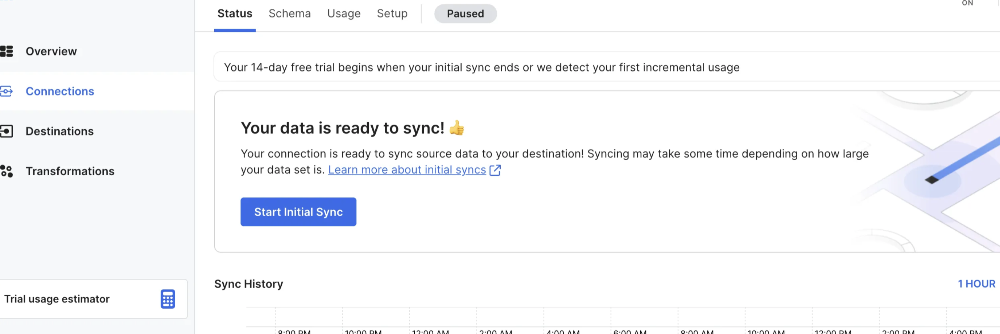
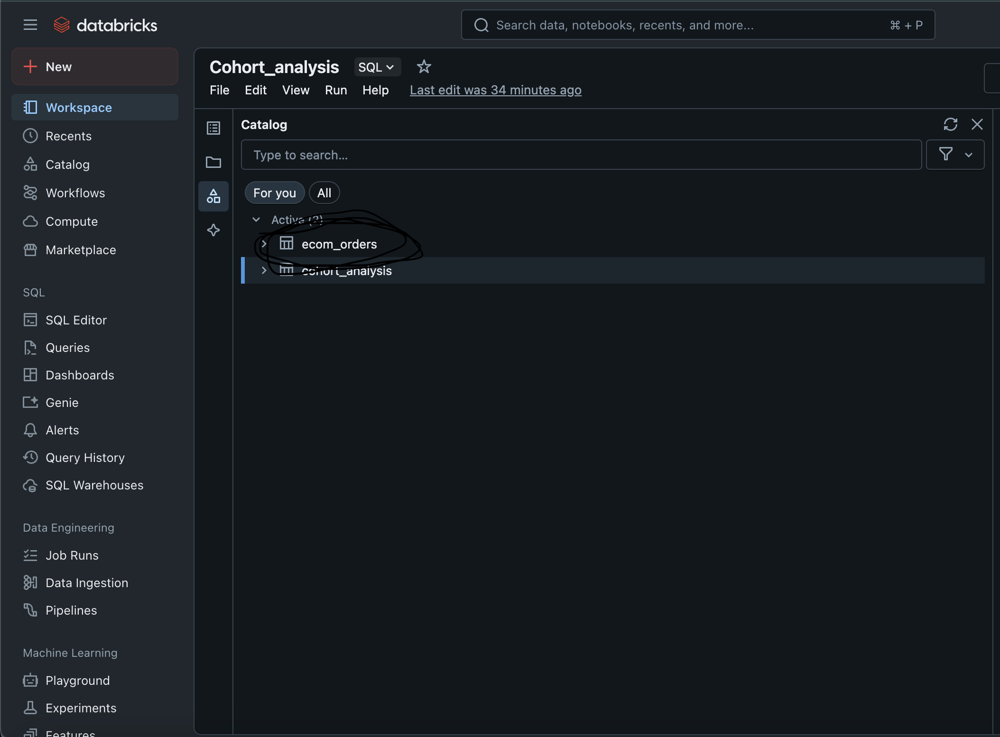

# Connecting Fivetran to Databricks

This document outlines the steps I followed to connect Fivetran to Databricks and verify the successful replication of my BigQuery data.

---

## Step 1: Search for Fivetran in the Partner Integrations

To start the integration, I searched for **Fivetran** under the Partner integrations in the Databricks console.

---

## Step 2: Connect to the Partner

Once I found the Fivetran partner, I clicked on it and selected the appropriate **SQL Warehouse** and **Catalog** to use with the integration.

---

## Step 3: Choose Deployment Model

I selected the **SaaS Deployment** option. This means the data will be processed in Fivetran’s cloud environment.

- I filled in the required fields, such as catalog name.
- The optional server hostname and other advanced fields were left blank.

---

## Step 4: Start Initial Sync

Back in Fivetran, after the setup was tested successfully, I clicked **Start Initial Sync** to begin transferring data from BigQuery to Databricks.

---

## Step 5: Confirm the Data Landed in Databricks

After the sync completed, I went to Databricks and confirmed that the `ecom_orders` table had arrived successfully under the selected catalog.

---

With this, the connection between BigQuery → Fivetran → Databricks was successfully established. Now I can run queries and perform cohort analysis inside Databricks using the synced data.
