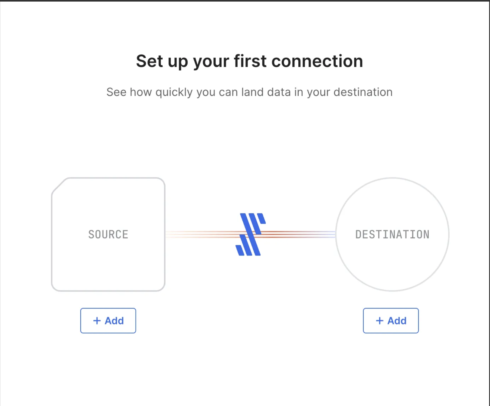
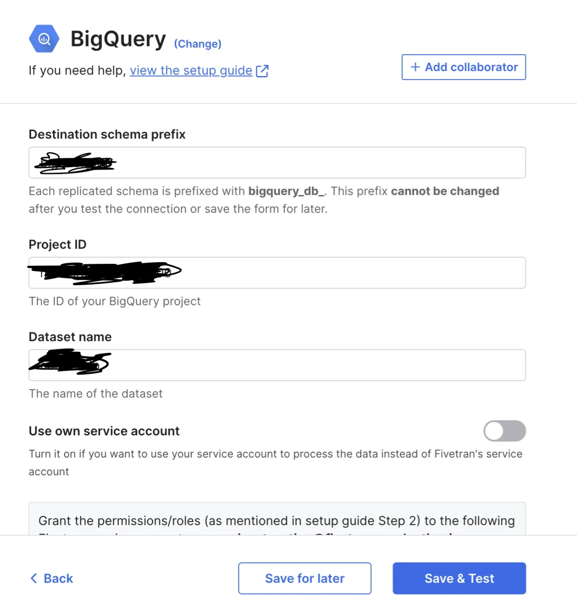
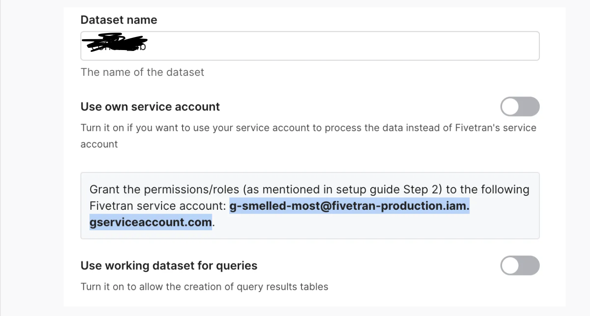
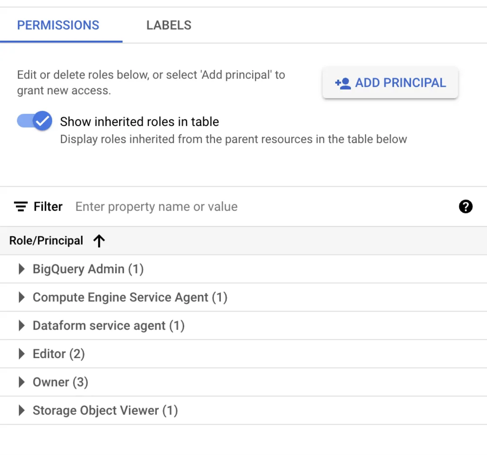
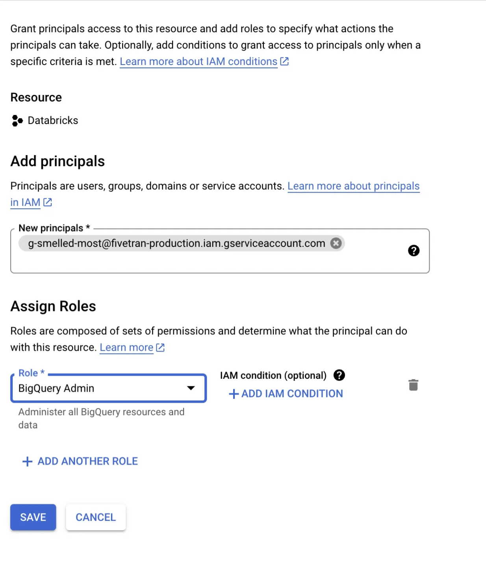

# Fivetran Setup & Connection to BigQuery

This section documents the steps I followed to set up Fivetran, connect BigQuery as a source, and configure the necessary permissions to enable secure and successful data transfer.

---

## Step 1: Start Fivetran Connection Setup

I opened Fivetran and started setting up a new connection between a source and a destination.

---

## Step 2: Provide BigQuery Project Details

In the BigQuery configuration screen, I filled out the required details:

- **Destination schema prefix**
- **Project ID**
- **Dataset name**

> Note: The destination schema prefix is auto-assigned and cannot be changed later.

---

## Step 3: Copy the Fivetran Service Account

Copied the Fivetran service account email shown in the connection screen. This account needs access to BigQuery to read the dataset.

---

## Step 4: Open IAM Permissions in Google Cloud Console

Opened the **IAM & Admin** section of my GCP project and clicked on the **Permissions** tab. Then, I selected **Add Principal**.

---

## Step 5: Grant BigQuery Admin Role to Fivetran

I added the copied Fivetran service account and assigned it the **BigQuery Admin** role to allow access to the dataset.

---

✅ Now Fivetran is authorized to access the project and the specific dataset in BigQuery. The setup is complete and ready for syncing.
