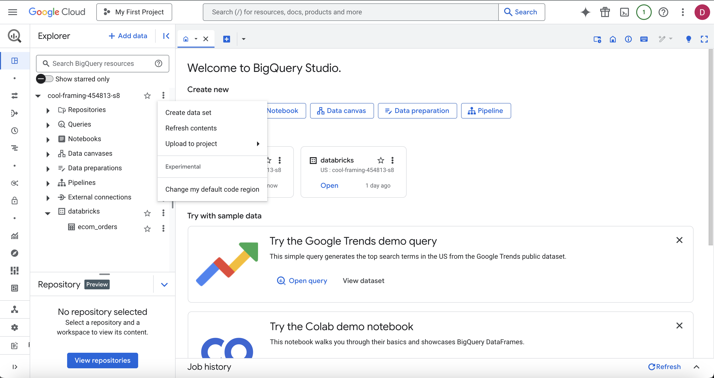
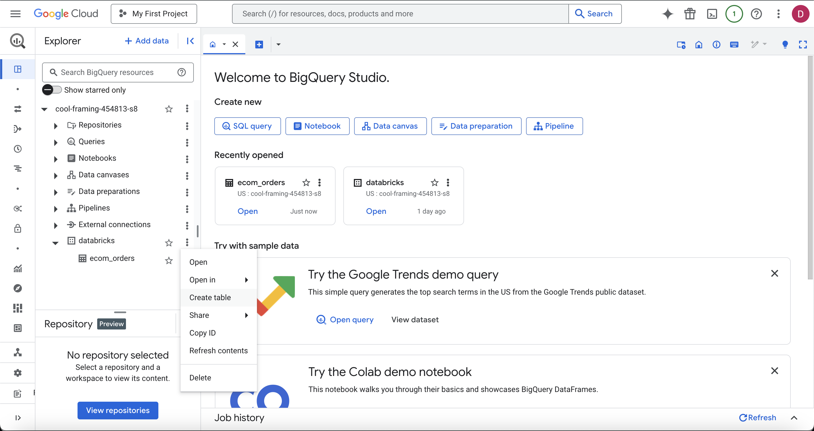
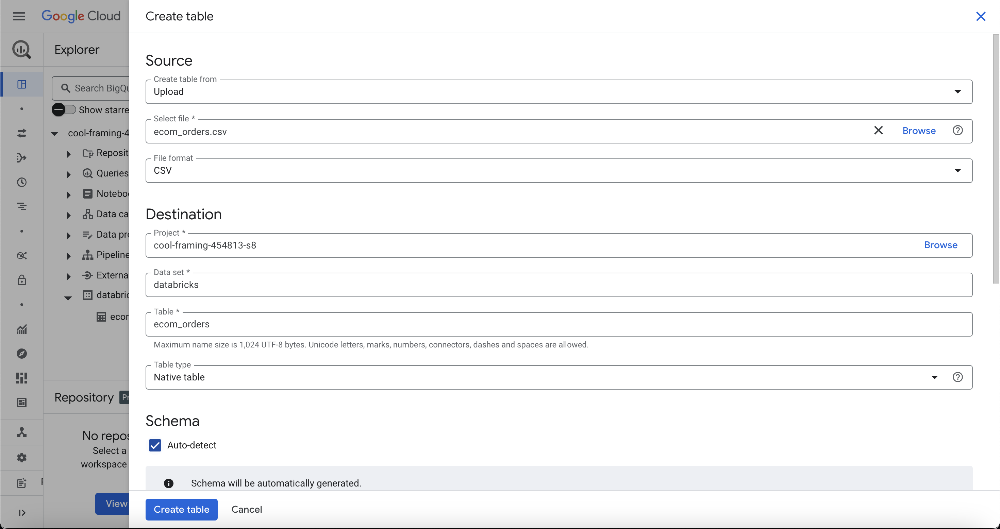

# Uploading Data to BigQuery

This document outlines the steps I followed to upload my dataset to BigQuery and prepare it for integration with Fivetran and Databricks.

---

## ✅ Step 1: Open BigQuery Studio and Select Your Project

I started by opening [BigQuery Studio](https://console.cloud.google.com/bigquery) and selecting the project I want to work with. In my case, the project name is visible in the left-hand panel.

---

## ✅ Step 2: Create a New Dataset

From the Explorer panel, I right-clicked the project name and selected **"Create dataset"**. This dataset will act as a container for the table I'm about to upload.

---

## ✅ Step 3: Create a New Table

After creating the dataset, I clicked on the dataset name and selected **"Create table"**. I uploaded my `.csv` file as the source and named the table `ecom_orders`.

---

## ✅ Step 4: Upload Data and Set Table Options

I made sure to:
- Choose "Upload" as the source.
- Select `ecom_orders.csv`.
- Use "CSV" as the file format.
- Select the correct project and dataset.
- Enable "Auto-detect" for schema detection.
- Confirm table type as "Native table".

Then I clicked **Create table** to complete the process.

---

The data is now successfully uploaded to BigQuery and ready for the next steps in the data pipeline setup (like Fivetran integration).
